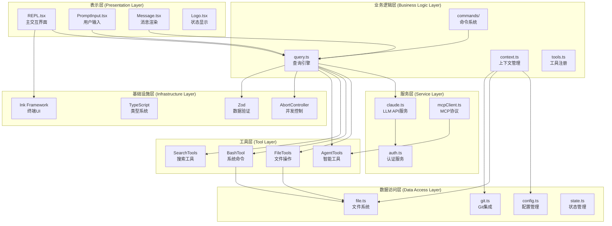
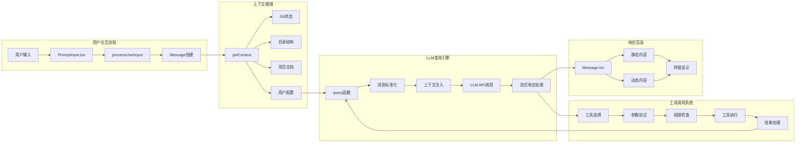
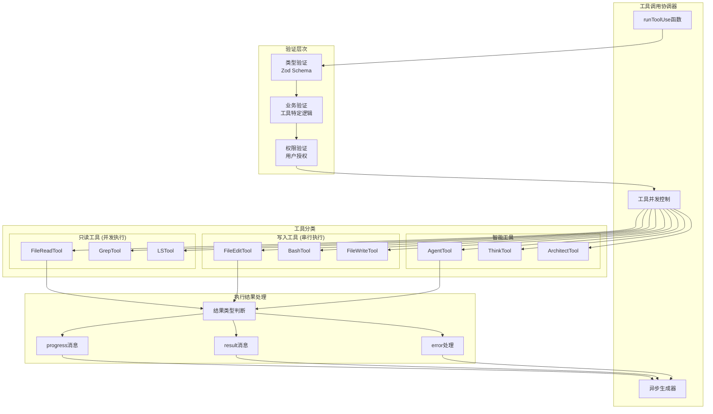
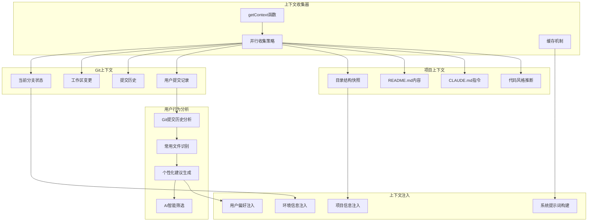
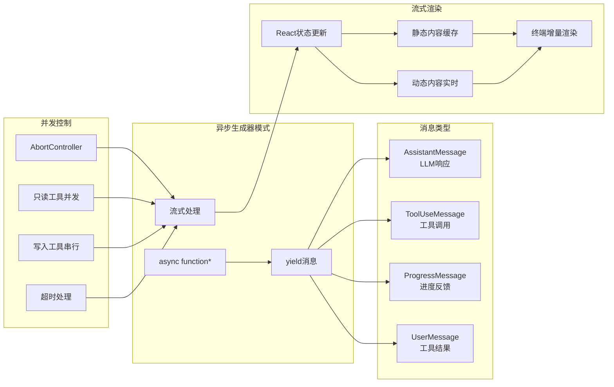
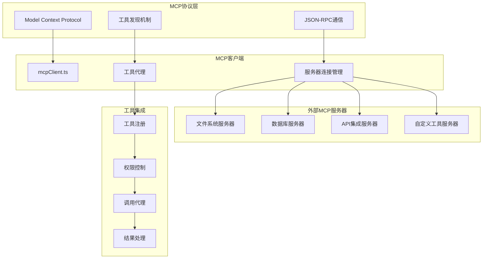
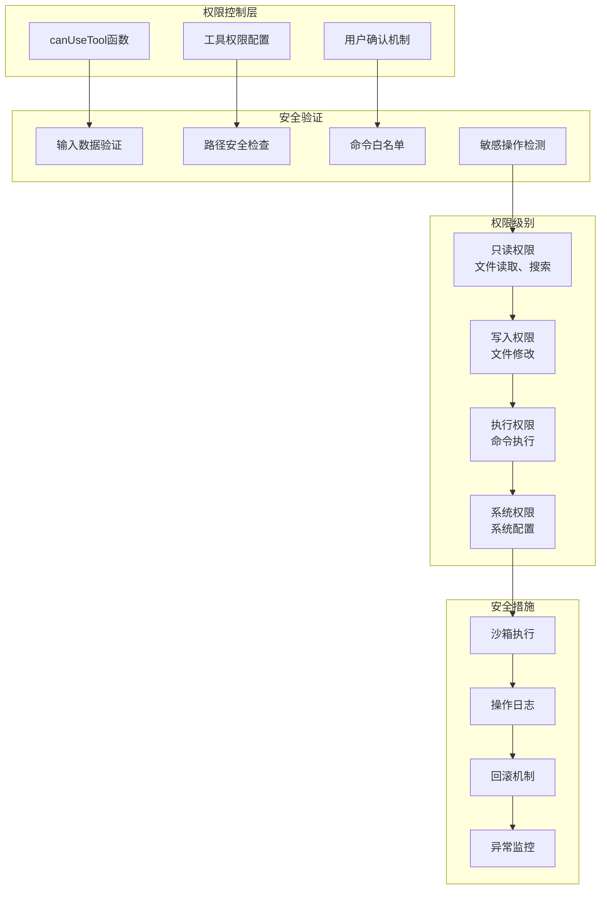

# Claude Code CLI 架构分层图

## 1. 整体架构分层图



## 2. 核心数据流架构图



## 3. 工具调用系统架构图



## 4. 配置管理系统架构图

```mermaid
graph TB
    subgraph "配置层次结构"
        G1[全局配置<br/>~/.claude/config.json]
        P1[项目配置<br/>.claude/config.json]
        R1[运行时配置<br/>命令行参数]
    end
    
    subgraph "配置内容"
        C1[工具权限配置]
        C2[API密钥配置]
        C3[项目上下文配置]
        C4[MCP服务器配置]
        C5[用户偏好配置]
    end
    
    subgraph "配置加载优先级"
        L1[命令行参数 (最高)]
        L2[项目配置]
        L3[全局配置 (最低)]
    end
    
    subgraph "配置验证"
        V1[JSON Schema验证]
        V2[必需字段检查]
        V3[类型安全验证]
    end
    
    G1 --> C1
    G1 --> C2
    G1 --> C5
    P1 --> C1
    P1 --> C3
    P1 --> C4
    R1 --> C1
    R1 --> C2
    
    L1 --> V1
    L2 --> V1
    L3 --> V1
    V1 --> V2
    V2 --> V3
```

## 5. 上下文感知系统架构图



## 6. 异步生成器流式架构图



## 7. MCP集成架构图



## 8. 安全和权限架构图



这些架构图从不同维度展现了Claude Code CLI的设计理念：

1. **分层清晰**: 从表示层到基础设施层的清晰分离
2. **流式处理**: 异步生成器实现的流式用户体验  
3. **工具系统**: 插件化的工具架构和权限控制
4. **上下文感知**: 智能的项目和用户行为分析
5. **安全可靠**: 多层次的安全验证和权限控制
6. **可扩展性**: MCP协议支持的第三方工具集成

整体架构体现了现代CLI工具的最佳实践，在功能完整性和代码可维护性之间取得了良好平衡。