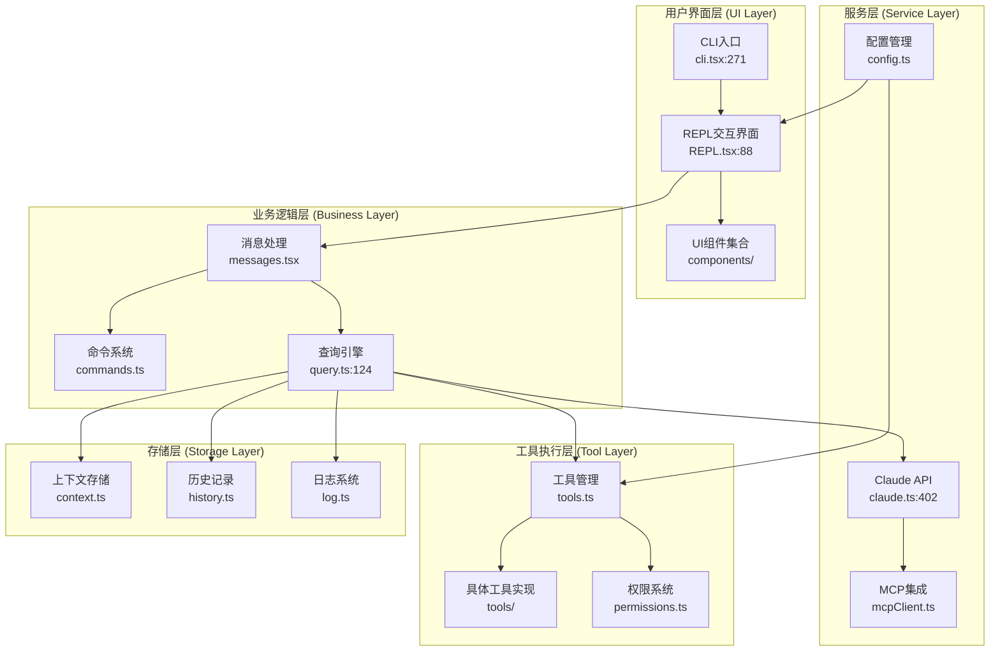
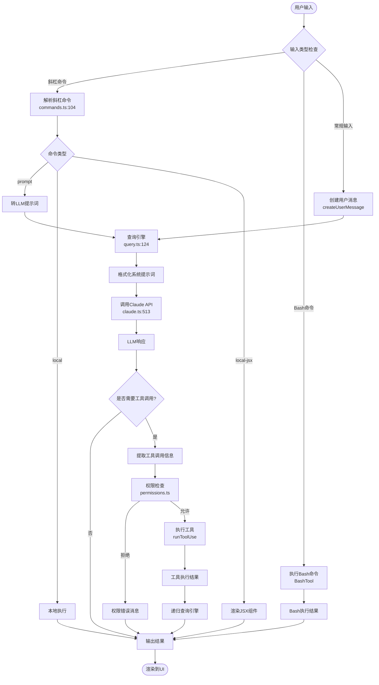
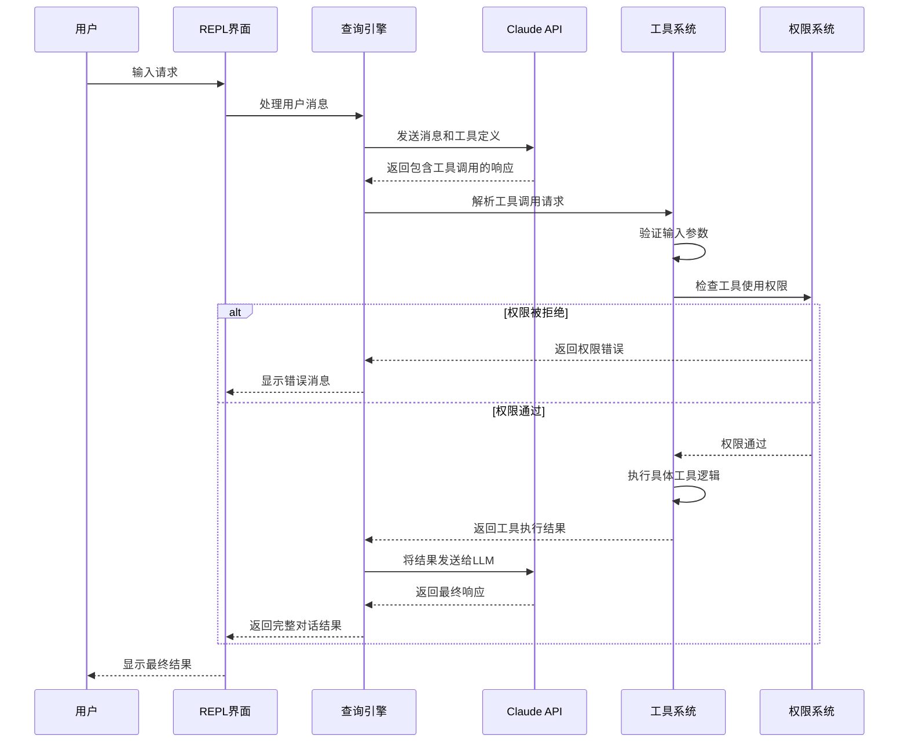
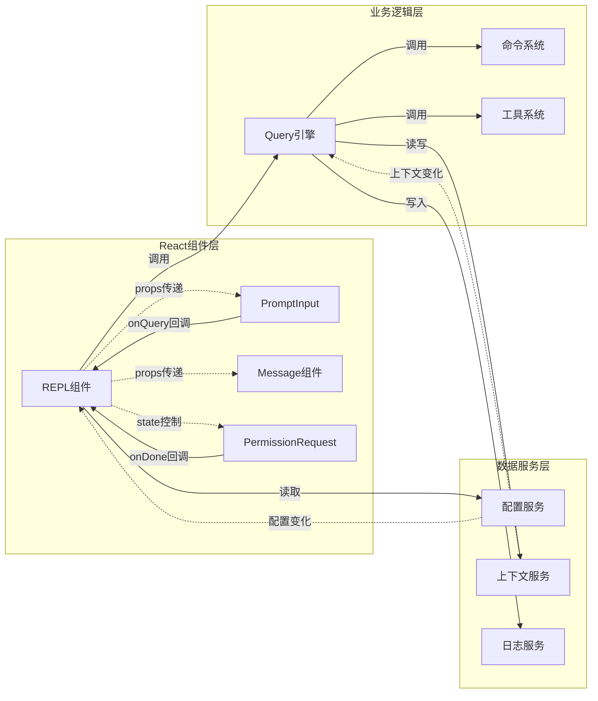
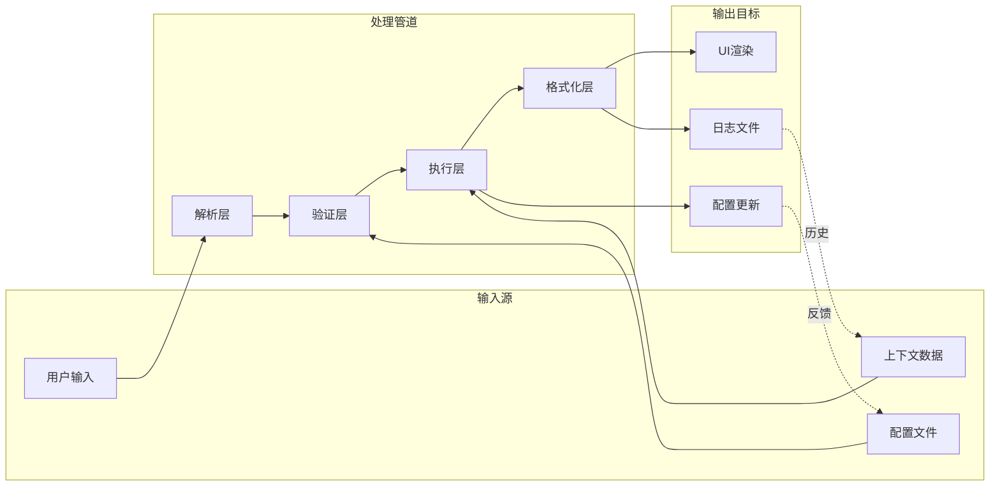
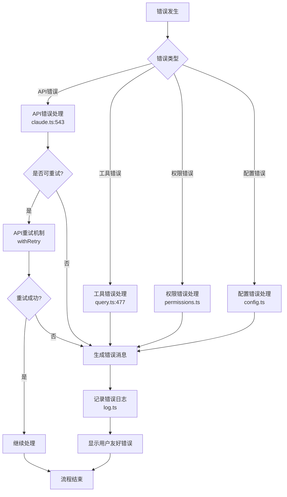

# Claude Code 架构图与流程图

## 1. 系统整体架构图



## 2. 用户输入处理流程图



## 3. 工具执行流程图



## 4. 组件协同关系图



## 5. 数据流向图



## 6. 异步处理时序图

```mermaid
sequenceDiagram
    participant UI as UI线程
    participant Query as Query引擎
    participant Tool1 as 工具1
    participant Tool2 as 工具2
    participant API as Claude API
    
    UI->>Query: 启动查询
    Query->>API: 发送请求
    API-->>Query: 返回包含多个工具调用
    
    par 并发工具执行
        Query->>Tool1: 异步执行工具1
        and
        Query->>Tool2: 异步执行工具2
    end
    
    Tool1-->>Query: 返回结果1
    UI<<--Query: 实时更新UI (progress)
    
    Tool2-->>Query: 返回结果2  
    UI<<--Query: 实时更新UI (progress)
    
    Query->>API: 发送所有工具结果
    API-->>Query: 返回最终响应
    Query-->>UI: 完成查询
```

## 7. 错误处理流程图



## 图例说明

- **实线箭头** (→): 直接调用关系
- **虚线箭头** (-.->): 数据流或配置传递
- **双向箭头** (↔): 双向通信
- **并行块** (par): 并发执行
- **判断菱形** ({}): 条件分支
- **圆角矩形** ([]): 处理步骤
- **圆形** (()): 开始/结束节点

这些图表展示了Claude Code系统的完整架构设计，包括组件关系、数据流向、异步处理和错误处理等关键方面。